###
**1º. Activa desde SQL*Plus la auditoría de los intentos de acceso fallidos al sistema. 
Comprueba su funcionamiento.**
Activamos la auditoría.
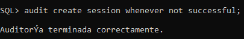

Comprobamos que la auditoría está activa
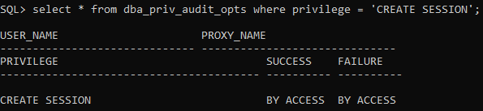

Tras activar la auditoría, vamos a connectarnos al sistema introduciendo las credenciales incorrectamente.
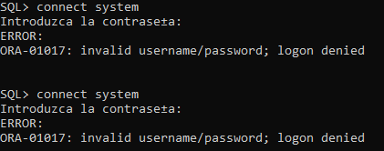

Comprobamos el diccionario de dados para comprobar los fallos tras intentar iniciar sesión.
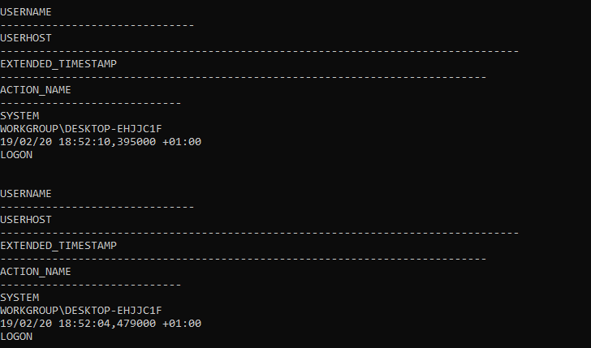 

###
**2º. Realiza un procedimiento en PL/SQL que te muestre los accesos fallidos junto con el motivo de los mismos, 
transformando el código de error almacenado en un mensaje de texto comprensible.**
Comprobamos los números de errores que podemos contemplar
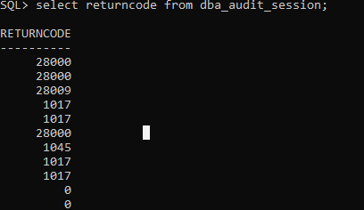
- 1017 => Usuario/contraseña incorrecta
- 28000 => Cuenta bloqueada
- 1045 => No se tiene el privilegio "CREATE SESSION"

Función para obtener el return code
~~~
create or replace function codigo(p_numero	NUMBER)
return VARCHAR2
is 
	v_mensaje	VARCHAR2(50);
begin 
	if p_numero = 1045 then
		v_mensaje:='No tiene el privilegio "CREATE SESSION"';
	elsif p_numero = 1017 then
		v_mensaje:='Usuario/contraseña incorrectos';
	elsif p_numero = 28000 then 
		v_mensaje:='Cuenta bloqueada';
	else
		v_mensaje:='Error';
	end if;
return v_mensaje;
end codigo;
/

create or replace procedure ejercicio2
is
	cursor c_auditoria
	is
	select username,returncode, timestamp
	from dba_audit_session
	where action_name = 'LOGON'
	and returncode != 0;

	v_mensaje	VARCHAR2(50);
begin
	for i in c_auditoria loop
		v_mensaje:=codigo(i.returncode);
		dbms_output.put_line('Usuario: '||i.username||'Código: '||i.returncode||'Fecha: '||i.timestamp||'Mensaje de error: '||v_mensaje);
	end loop;
end ejercicio2;
/
~~~

###
**3º. Activa la auditoría de las operaciones DML realizadas por SCOTT. Comprueba su funcionamiento.**
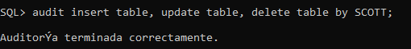

Vamos a logearnos con el usuario scott,crearemos una tabla a la cuál añadiremos un registro a la tabla, lo actualizaremos y lo borraremos
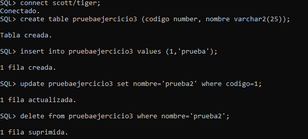

Vamos a logearnos como dba para comprobar las modificaciones que ha realizado scott. Realizamos la consulta al diccionario de datos.
~~~
SQL> select obj_name, action_name, timestamp
  2  from dba_audit_object
  3  where username = 'SCOTT';
~~~

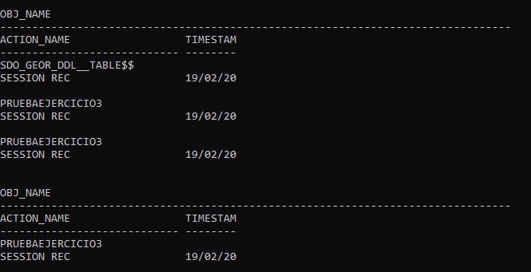

###
**4º. Realiza una auditoría de grano fino para almacenar información sobre la inserción de empleados del departamento 10 en la tabla emp de scott.**
Creo la auditoría 
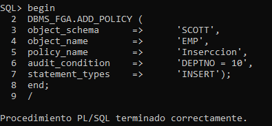

Nos conectamos como usuario SCOTT e inserto un registro en la tabla emp
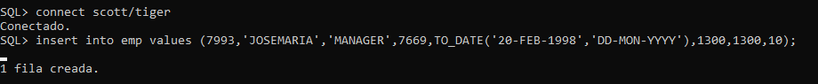

Finalmente comprobamos el funcionamiento
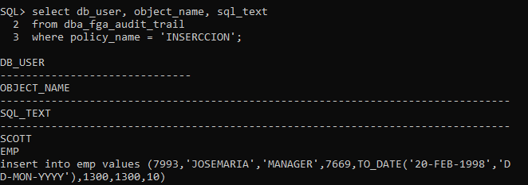

###
**5º. Explica la diferencia entre auditar una operación by access o by session.
- *By Access* => la auditoria nos almacena todas las acciones realizadas incluso nos almacena también las repetidas
- *By Session* => la auditoria nos almacena un registro de una acción solamente

###
**6º. Documenta las diferencias entre los valores db y db, extended del parámetro audit_trail de ORACLE. 
Demuéstralas poniendo un ejemplo de la información sobre una operación concreta recopilada con cada uno de ellos.**
- *db* => activa la auditoría y los datos se almacenan en la tabla SYS.AUD$ 
- *db,extend* => Igual que db pero los valores se escribirán en las columnas sqlbind y sqltext de la tabla SYS.AUD$

Comprobamos el estado del parámetro audit_trail
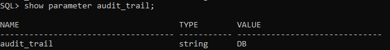

Ahora cambiamos el parámetro audit_trail a db,extend
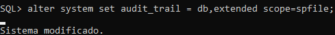

Para que se produzca el cambio reiniciaremos oracle y comprobaremos el parámetro audit_trail 
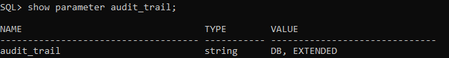

###
**7º. Localiza en Enterprise Manager las posibilidades para realizar una auditoría e intenta repetir con dicha herramienta los apartados 1, 3 y 4.**
 

### 
**8º. Averigua si en Postgres se pueden realizar los apartados 1, 3 y 4.
Si es así, documenta el proceso adecuadamente.**

Postgresql sí nos permite auditar los inicios de sesión a través del fichero de log postgresql-11-main.log, para comprobarlo, intentaremos usar una tabla 
con un nombre de usuario que no existe.
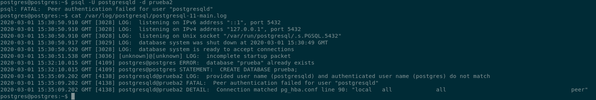

Para auditar las tablas creamos un trigger de ejemplo
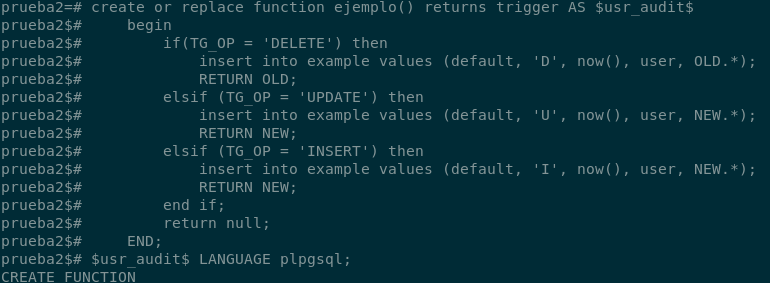

###
**9º. Averigua si en MySQL se pueden realizar los apartados 1, 3 y 4. Si es así, documenta el proceso adecuadamente.**
Creamos una base de datos y un usuario para poder realizar las pruebas de funcionamiento.
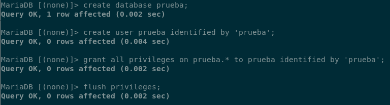

Vamos a crear 2 tablas, una será para añadir los registros y la otra tabla servirá para guardar los logs del sistema
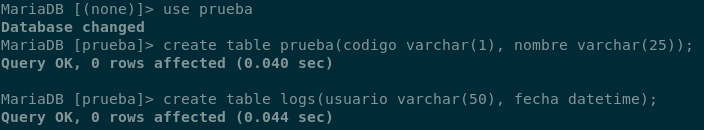

Tras tener las tablas creadas, vamos a crear un trigger que nos permite auditar las tablas, tenemos 3 tipos de trigger: insert, delete y update. En mi caso,
voy a utilizar el trigger insert. Tras crear el trigger, añadiré un registro a la tabla prueba y a continuación, comprobaré la tabla de logs
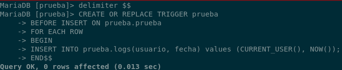

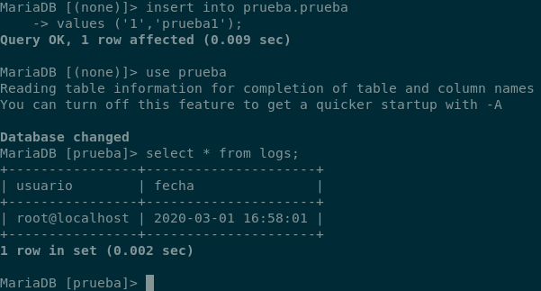

###
**10º. Averigua las posibilidades que ofrece MongoDB para auditar los cambios que va sufriendo un documento.**

###
**11º. Averigua si en MongoDB se pueden auditar los accesos al sistema.**
Para auditar los accesos al sistema en mongodb, usamos lo siguiente 
~~~
{ atype: "authenticate","param.db":"<nombrebd>" }
~~~

