###
**1º. Realiza una copia de seguridad lógica de tu base de datos completa, teniendo en cuenta los siguientes requisitos:
- La copia debe estar encriptada y comprimida.
- Debe realizarse en un conjunto de ficheros con un tamaño máximo de 100 MB.
- Programa la operación para que se repita cada día a una hora determinada.**

Creamos un directorio en el cuál vamos a guardar todas las copias
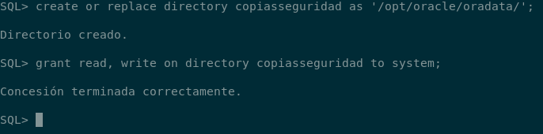

Hacemos la copia encriptada y comprimida con un tamaño máximo de 100MB
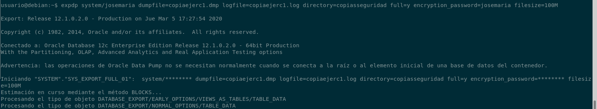

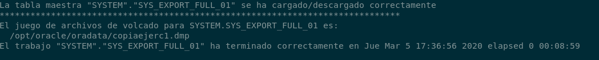

Para programar la operación, he creado una tarea de cron usando un script con el mismo comando utlizado anteriormente
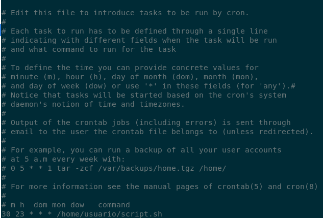

###
**2º. Restaura la copia de seguridad lógica creada en el punto anterior.**
Para la restauración, vamos a usarla en una máquina limpia 

###
**3º. Realiza un script de sistema operativo que automatice las operaciones necesarias para realizar una copia de seguridad física offline de tu base de datos, copiando todos los ficheros requeridos y borrando los archivos existentes si se habían realizado otras copias de seguridad previamente.**
*El script tenemos que ejecutarlo con superusuario*
~~~
#!/bin/bash
ruta=/home/oracle

if [-e $ruta/copiasseguridad]
then
        rm -rf $ruta/copiasseguridad
        mkdir $ruta/copiasseguridad
        cp -r /opt/oracle/oradata/orcl/* $ruta/copiasseguridad
        cp -r /opt/oracle/product/12.1.0.2/dbhome_1/* $ruta/copiasseguridad
        cp -r /opt/oracle/fast_recovery_area/* $ruta/copiasseguridad
else
         mkdir $ruta/copiasseguridad
        cp -r /opt/oracle/oradata/orcl/* $ruta/copiasseguridad
        cp -r /opt/oracle/product/12.1.0.2/dbhome_1/* $ruta/copiasseguridad
        cp -r /opt/oracle/fast_recovery_area/* $ruta/copiasseguridad
fi
~~~

###
**4º. Programa el script del ejercicio anterior para que se ejecute automáticamente todos los días a una hora determinada.**
He creado una tarea en cron para que es ejecute todos los días
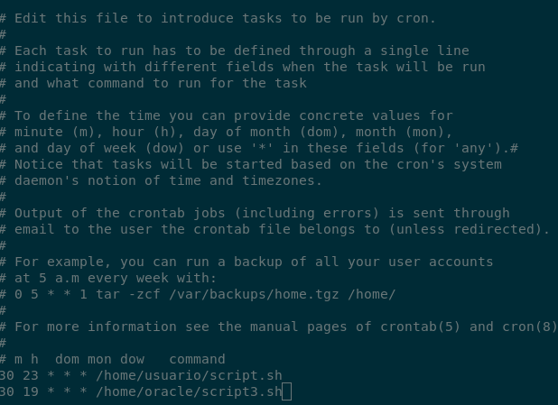

###
**5º. Pon tu base de datos en modo ArchiveLog y realiza con RMAN una copia de seguridad física en caliente. Realiza después la misma operación empleando Enterprise Manager.**
Antes de activar el archivelog, vamos a comprobar que está desactivado
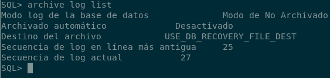

Vamos a crear una carpeta para guardar los logs
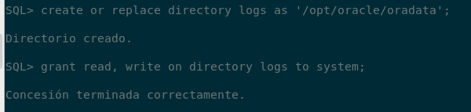

Tras ésto cambiamos nuestra base de datos a archivelog
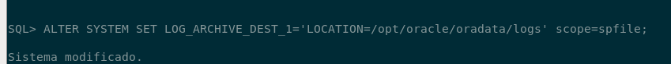

Apagamos la base de datos y la montamos y la cambiamos en archive log
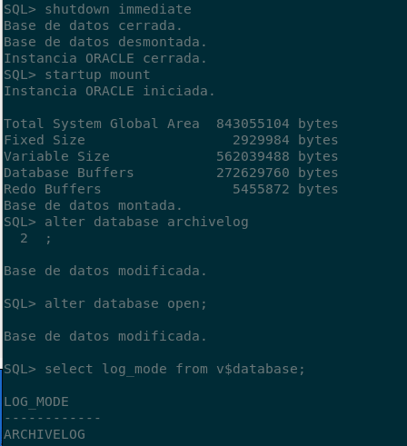

Para hacer la copia de seguridad en caliente usaremos rman aunque no he sido capaz de hacerla, adjunto cómo pienso que es
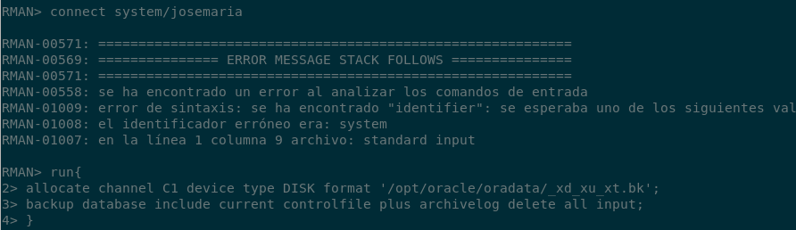

###
**8º. Documenta el empleo de herramientas de copia de seguridad y restauración en Postgres.**
Para la copia de seguridad de postgres la realizaremos a partir del usuario postgres
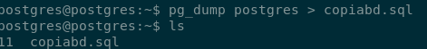

Para importar la copia realizada anteriormente
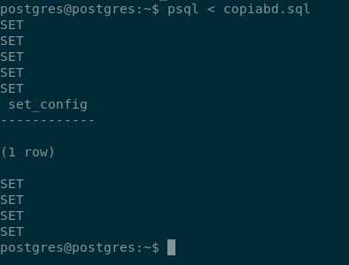

###
**9º. Documenta el empleo de herramientas de copia de seguridad y restauración en MySQL.**
Para realizar la copia ejecutaremos
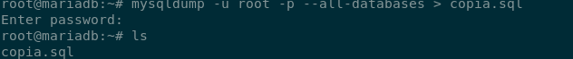

Para importarla
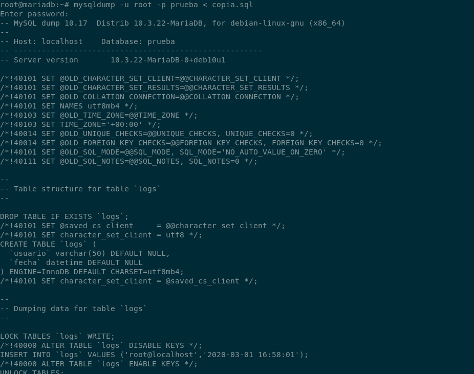

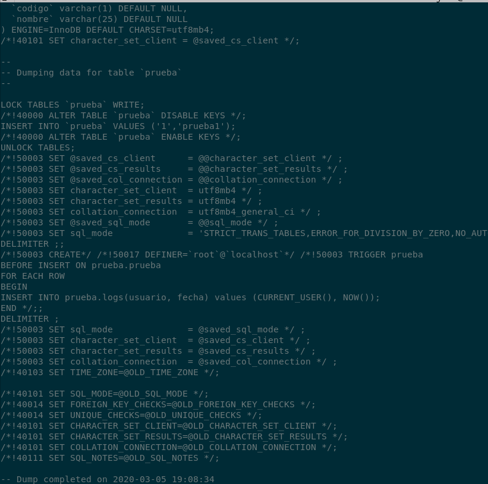

###
**10º. Documenta el empleo de herramientas de copia de seguridad y restauración en MongoDB.**
Para hacer la copia la haremos así
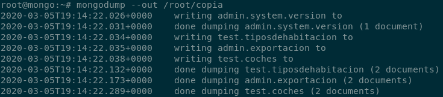
Usa por defecto el puerto de mongo 27017

Para restaurar la copia usaremos 
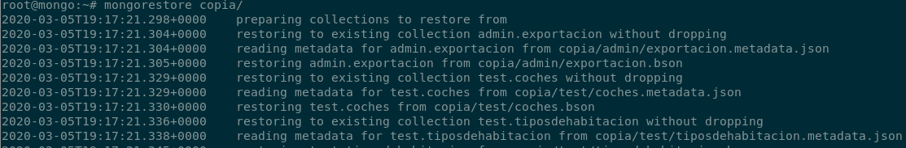
