###
**1º. Realiza una exportación del esquema de SCOTT usando la consola Enterprise Manager, con las siguientes condiciones:
- Exporta tanto la estructura de las tablas como los datos de las mismas.
- Excluye la tabla DEPT y los empleados cuyo sueldo es inferior a 1000.
- Programa la operación para dentro de 10 minutos.
- Genera un archivo de log en el directorio que consideres más oportuno.**
  
Primero crearemos un directorio y le asignaremos los permisos de lectura y escritura al usuario system
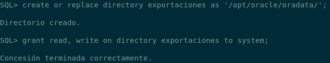

Exportamos tanto la estructura de las tablas como los datos de la mismas
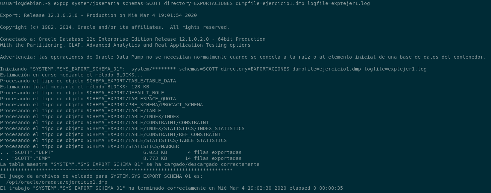

Excluimos la tabla dept y los empleados cuyo sueldo es inferior a 1000 
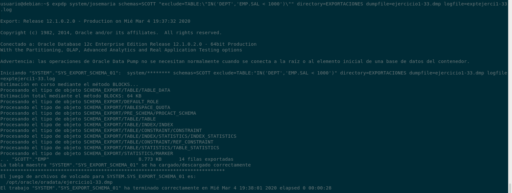

Programa la operación para que dentro de 10 min
Para ello he creado una tarea de cron para que se ejecute un script cada 10 minutos
~~~
usuario@debian:~$ cat script.sh 
#!/bin/bash
expdp system/josemaria schemas=SCOTT directory=EXPORTARCIONES dumpfile=ejercicio11.dmp logfile=exptejer1.log
10 * * * * /home/usuario/script.sh
~~~

###
**3º. Realiza una exportación de la estructura de todas las tablas de la base de datos usando el comando expdp de Oracle Data Pump probando todas las posibles opciones que ofrece dicho comando
 y documentándolas adecuadamente.**
Para comprobar todas las opciones que nos ofrece dicho parámetro usaremos el siguiente comando
~~~
expdp HELP=y
~~~

Realizamos la exportación
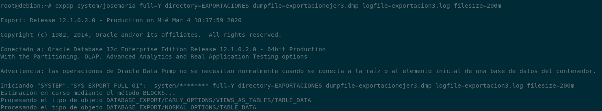

Comprobamos que la exportación se ha realizado correctamente
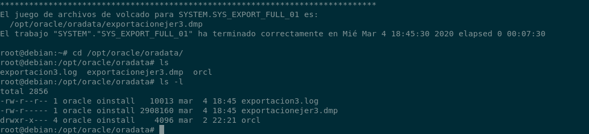

###
**4º. Intenta realizar operaciones similares de importación y exportación con una herramienta gráfica de administración de Postgres, 
documentando el proceso.**
Instalamos en nuestro servidor postgres el paquete phppgadmin
~~~
root@postgres:~# apt install phppgadmin
~~~

Tras instalar el paquete phppgadmin, nos instalará por dependecias apache y php. Editamos el fichero de configuración /etc/apache2/conf-available/phppgadmin.conf
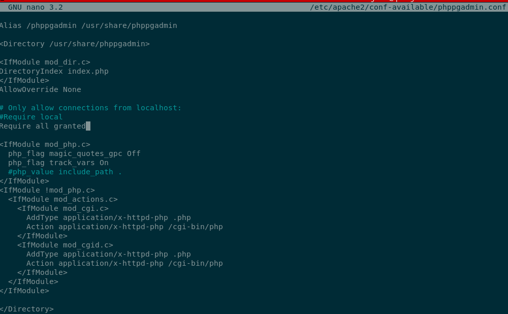

Ahora editamos el fichero de configuración general /etc/phppgadmin/config.inc.php dejamos el siguiente parámetro así
~~~
$conf['extra_login_security'] = false;
$conf['servers'][0]['desc'] = 'PostgreSQL';
        $conf['servers'][1]['desc'] = 'ExternoPSQL';

        // Hostname or IP address for server.  Use '' for UNIX domain socket.
        // use 'localhost' for TCP/IP connection on this computer
        $conf['servers'][0]['host'] = 'localhost';
        $conf['servers'][1]['host'] = '192.198.1.130';

        // Database port on server (5432 is the PostgreSQL default)
        $conf['servers'][0]['port'] = 5432;
        $conf['servers'][1]['port'] = 5432;
~~~

Tras realizar ésta configuración, reiniciamos el servicio de apache2
~~~
root@postgres:~# systemctl restart apache2.service 
~~~

Comprobamos que tenemos instalado la herramienta web
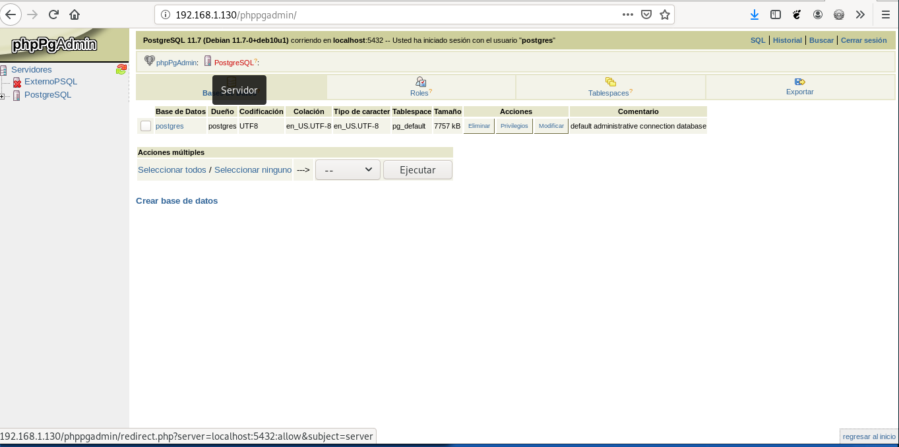

Con la herramienta gráfica phppgadmin sólo tengo la opción de exportar datos, exportaremos datos en formato SQL
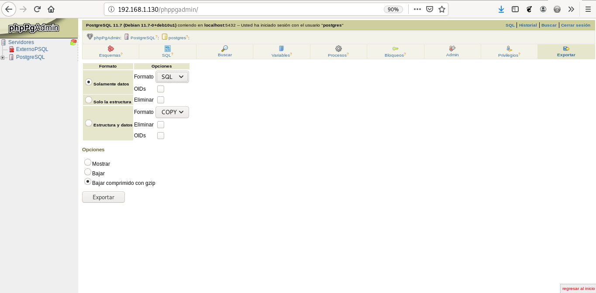

Podemos observar que podemos descargarnos la exportación de forma comprimida con gzip
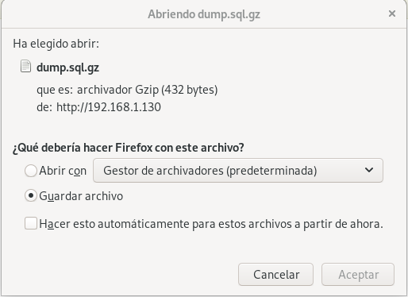

###
**5º. Exporta todos los documentos de una colección de MongoDB que tengan más de cuatro campos e impórtalos en otra base de datos.**
Voy a crear en mongo 2 colecciones
~~~
> db.tiposdehabitacion.insert({
... Codigo: ["1","2","3"],
... Nombre: ["Individual","Doble","Suite"]
... })
WriteResult({ "nInserted" : 1 })
> db.coches.insert({
... Marca: "Porsche",
... Modelo: "911 carrera",
... Motor: "3.0 V6 biturbo",
... Caballos: "420",
... Color: "Negro"
... })
WriteResult({ "nInserted" : 1 })
~~~

Éstas colecciones han sido creadas en la base de datos test, ahora vamos a importarla la colección coches que tiene más de 4 campos.
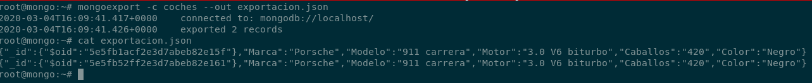

Comprobamos que la base de datos admin no tiene colecciones
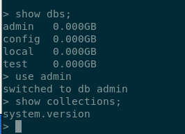

Ahora vamos a importar la exportación anterior en la base de datos admin
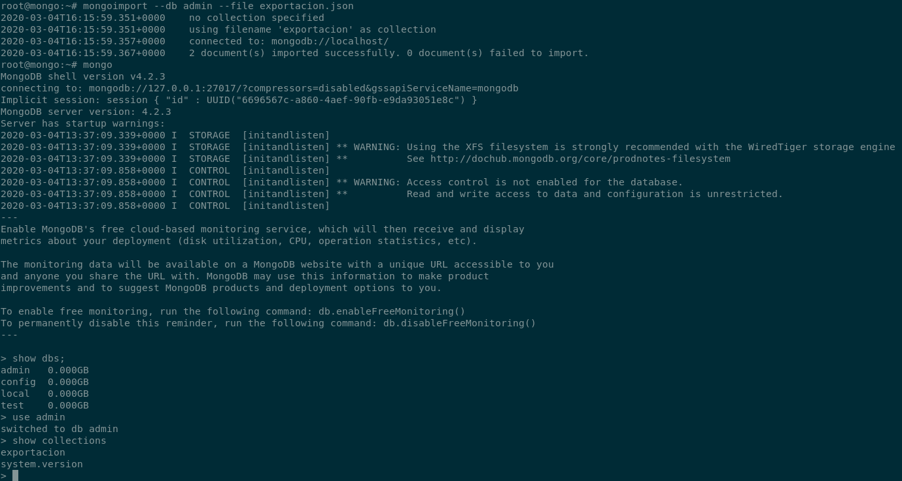

